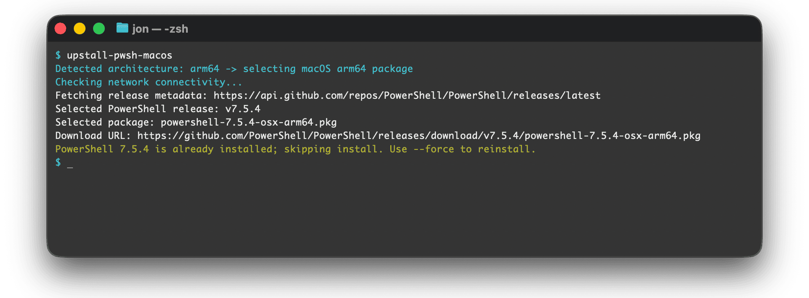

# PowerShell Core Upstall Scripts

[](https://github.com/jonlabelle/pwsh-upstall/actions/workflows/ci.yml)

Platform-specific scripts to install/update PowerShell Core from GitHub releases with SHA256 verification, including shared `hashes.sha256` manifests.

- **macOS**: `pwsh-upstall-macos.sh` — Apple Silicon & Intel
- **Linux**: `pwsh-upstall-linux.sh` — x64/arm64, glibc/musl (Alpine)
- **Windows**: `pwsh-upstall-windows.ps1` — x64/arm64

Upgrades remove the previously active version by default. Use `--keep-old-version` or `-KeepOldVersion` to opt out.



## Table of contents

- [Install](#install)
  - [One-liners](#one-liners)
  - [Other options](#other-options)
- [Run locally](#run-locally)
- [Troubleshooting](#troubleshooting)
- [License](#license)

## Install

### One-liners

#### macOS

```bash
curl -fsSL https://raw.githubusercontent.com/jonlabelle/pwsh-upstall/refs/heads/main/pwsh-upstall-macos.sh | bash
```

#### Linux

```bash
curl -fsSL https://raw.githubusercontent.com/jonlabelle/pwsh-upstall/refs/heads/main/pwsh-upstall-linux.sh | sh
```

#### Windows

> [!Important]
> Requires Administrator privileges. Run from an [elevated PowerShell prompt](https://learn.microsoft.com/powershell/scripting/windows-powershell/starting-windows-powershell#run-with-administrative-privileges).

```powershell
irm 'https://raw.githubusercontent.com/jonlabelle/pwsh-upstall/refs/heads/main/pwsh-upstall-windows.ps1' |
    powershell -NoProfile -ExecutionPolicy Bypass -
```

> [!Note]
> Run from Windows PowerShell (`powershell.exe`), not PowerShell Core (`pwsh.exe`), to avoid process-in-use errors.
> If you need `-Tag`, `-Check`, `-WhatIf`, or other script parameters, use `powershell -File .\pwsh-upstall-windows.ps1 ...` instead; `powershell.exe -` does not pass script arguments through stdin mode.

---

### Other options

#### Option 1: Clone the repo with Git

```bash
git clone https://github.com/jonlabelle/pwsh-upstall.git
cd pwsh-upstall

# macOS
bash pwsh-upstall-macos.sh

# Linux
sh pwsh-upstall-linux.sh

# Windows (from PowerShell, requires Admin privileges)
powershell -File .\pwsh-upstall-windows.ps1
```

#### Option 2a: Download the archive (macOS/Linux)

```bash
curl -L -o pwsh-upstall.zip https://github.com/jonlabelle/pwsh-upstall/archive/refs/heads/main.zip
unzip pwsh-upstall.zip
cd pwsh-upstall-main

# macOS
bash pwsh-upstall-macos.sh

# Linux
sh pwsh-upstall-linux.sh
```

#### Option 2b: Download the archive (Windows)

```powershell
Invoke-WebRequest -Uri https://github.com/jonlabelle/pwsh-upstall/archive/refs/heads/main.zip -OutFile pwsh-upstall.zip
Expand-Archive -Path pwsh-upstall.zip -DestinationPath .
Set-Location .\pwsh-upstall-main

# Windows (requires Admin privileges)
powershell -File .\pwsh-upstall-windows.ps1
```

### Common actions

| Action                           | macOS                                 | Linux                                 | Windows                                                  |
| -------------------------------- | ------------------------------------- | ------------------------------------- | -------------------------------------------------------- |
| Install/update latest stable     | `./pwsh-upstall-macos.sh`             | `./pwsh-upstall-linux.sh`             | `powershell -File .\pwsh-upstall-windows.ps1`            |
| Check if up to date (no install) | `./pwsh-upstall-macos.sh --check`     | `./pwsh-upstall-linux.sh --check`     | `powershell -File .\pwsh-upstall-windows.ps1 -Check`     |
| Uninstall                        | `./pwsh-upstall-macos.sh --uninstall` | `./pwsh-upstall-linux.sh --uninstall` | `powershell -File .\pwsh-upstall-windows.ps1 -Uninstall` |

### Select a version (`--tag` / `-Tag`)

Use semver selectors to choose a release:

```text
v7      -> latest 7.x release
v7.5    -> latest 7.5.x release
v7.5.4  -> specific patch release
```

Examples:

```bash
./pwsh-upstall-macos.sh --tag v7
./pwsh-upstall-linux.sh --tag v7.5
```

```powershell
powershell -File .\pwsh-upstall-windows.ps1 -Tag v7.5.4
```

> [!Note]
> Prereleases require an explicit exact tag (for example, `v7.6.0-preview.1`). Default/latest/major/minor selection is stable-only.

### Option mapping

| Purpose                             | macOS/Linux          | Windows           |
| ----------------------------------- | -------------------- | ----------------- |
| Select version                      | `--tag <tag>`        | `-Tag <tag>`      |
| Save downloaded package/installer   | `--out-dir <dir>`    | `-OutDir <path>`  |
| Keep downloaded package/installer   | `--keep`             | `-Keep`           |
| Reinstall even if already installed | `--force`            | `-Force`          |
| Keep old version during upgrade     | `--keep-old-version` | `-KeepOldVersion` |
| Check only (no install)             | `--check`            | `-Check`          |
| Uninstall                           | `--uninstall`        | `-Uninstall`      |
| Skip SHA256 verification            | `--skip-checksum`    | `-SkipChecksum`   |
| Dry run                             | `-n, --dry-run`      | `-WhatIf`         |
| Help                                | `-h, --help`         | N/A               |

> [!Note]
> **Windows** automatically detects x64/arm64 architecture, requires Administrator privileges, and installs to `Program Files\PowerShell\7`.

## Troubleshooting

- **Checksum failed**: File corrupted or tampered. Retry or use `--skip-checksum`.
- **Insufficient disk space**: Requires 500MB minimum free space.
- **Permission denied**: Run with sudo (Linux/macOS) or as Administrator (Windows).
- **Process in use (Windows)**: Exit `pwsh.exe` and run from `powershell.exe` instead.
- **Windows parameters with one-liners**: The stdin launcher is fine for the default install, but `powershell.exe -` cannot accept extra script parameters. Use `powershell -File .\pwsh-upstall-windows.ps1 ...` for `-Tag`, `-Check`, `-WhatIf`, and similar options.

## License

[MIT](LICENSE)
